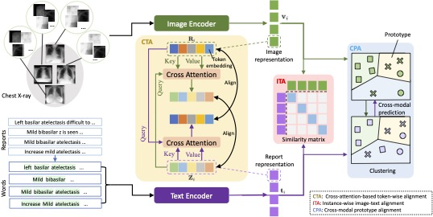

## MGCA
[Multi-Granularity Cross-modal Alignment for Generalized Medical Visual Representation Learning](https://arxiv.org/abs/2210.06044), NeurIPS 2022.



###  Installation
To clone this repository:
```
git clone https://github.com/fuying-wang/MGCA.git
```
To install Python dependencies:
```
pip install -r requirements.txt
```
To install package `mgca`:
```
pip install -e .
```

### Pretrain Convirt

```
cd mgca/models/convirt/
bash run_pretrain.sh
```